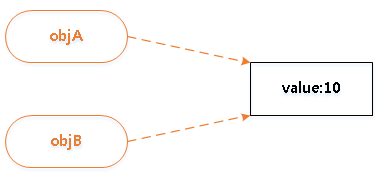
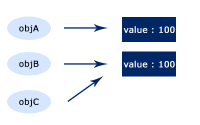

# 03 자바스크립트 테이터 타입과 연산자
모든 언어의 기본은 데이터 타입을 파악하는 것에서부터 시작한다.  
자바스크립트의 값들은 크게 `기본타입`과 `참조타입`으로 나뉜다.


## 3.1 자바스크립트의 기본 타입
>자바스크립트의 기본타입
- 숫자
- 문자열
- 불린값(true, fasle)
- null
- undefined  

이들 타입의 특징은 **그 자체가 하나의 값**을 나타낸다.  

자바스크립트는 **느슨한 타입 체크 언어**다.  
자바스크립트는 변수를 선언할 때 타입을 미리 정하지 않고, `var`라는 한 가지 키워드로만 변수를 선언한다.  
이렇게 선언된 변수에는 어떤 타입의 데이터라도 저장하는 것이 가능하다.  

### 3.1.1 숫자

C언어의 경우 정수냐 실수냐에 따라 int, long, float, double 등과 같은 다양한 숫자 타입이 존재하지만,  
**자바스크립트는 하나의 숫자형만 존재한다.**  
자바스크립트에서는 모든 숫자를 64bit 부동 소수점 형태로 저장하기 때문이다.
>var 키워드로 선언된 자바스크립트 변수에는 정수나 실수 구분 없이 그 값을 바로 저장 할 수 있으므로, intNum과 floatNum 변수 모두 typeof 연산자의 결과 값이 `number` 타입임을 확인할 수 있다.  

자바스크립트에서는 정수형이 따로 없고, 모든 숫자를 실수로 처리하므로 나눗셈 연산을 할 때는 주의해야 한다.  
```js
//자바스크립트 나눗셈 연산
var num = 5/2;
console.log(num);   // (출력값 2.5)
console.log(Math.floor(num));   // (출력값 2)
```
>Math.floor()  
C언어 나눗셈 연산 결과와 같이 소수 부분을 버린 정수 부분만을 구할 수 있다.

### 3.1.2 문자열
문자열은 작은 따옴표(')나 큰 따옴표(")로 생성한다.  
자바스크립트에서는 C언어의 char 타입과 같이 문자 하나만을 별도로 나타내는 데이터 타입은 존재하지 않는다.  

한번 정의된 문자열은 변하지 않는다.
```js
//str 문자열 생성
var str = 'test';
console.log(str[0], str[1], str[2], str[3]);    // (출력값 test)

//문자열의 첫 글자를 대문자로 변경?
str[0] = 'T';
console.log(str);   // (출력값 test)
```
>문자열은 문자 배열처럼 인덱스를 이용해서 접근할 수 있다.
자바스크립트에서는 한 번 생성된 문자열은 읽기만 가능하지 <strong>수정은 불가능</strong>하다.  

### 3.1.3 불린값
자바스크립트는 `true`와 `false` 값을 나타내는 불린 타입을 가진다.

### 3.1.4 null과 undefined
이 두 타입은 모두 자바스크립트에서 '값이 비어있음'을 나타낸다.  
자바스크립트 환경 내에서 기본적으로 값이 할당되지 않는 변수는 `undefined` 타입이다.  
> undefined 타입의 변수는 **변수 자체의 값 또한 undefined** 이다.

## 3.2 자바스크립트 참조 타입(객체 타입)
자바스크립트에서 `숫자`, `문자열`, `불린값`, `null`, `undefined` 같은 기본 타입을 제외한 <strong>모든 값은 객체</strong>이다.  
따라서 `배열`, `함수`, `정규표현식` 등 모두 결국 자바스크립트 `객체`로 표현된다.  
>자바스크립트에서 객체는 단순히 `이름(key) : 값(value)` 형태의 프로퍼티들을 저장하는 컨테이너이다.  

자바스크립트에서 기본타입은 하나의 값만을 가지는 데 비해,  
참조 타입인 객체는 여러 개의 프로퍼티들을 포함할 수 있으며, 이러한 객체의 프로퍼티는 기본 타입의 값을 포함하거나, 다른 객체를 카리킬 수도 있다.  

>**메서드**
프로퍼티의 성질에 따라 객체의 프로퍼티는 함수로 포함할 수 있다.  
자바스크립트에서는 이러한 프로퍼티를 _메서드_ 라고 부른다.  

### 3.2.1 객체생성
자바스크립트의 객체 개념은 생성 방법이나 상속 방식 등에서 C++이나 자바와 같은 기존 객체지향 언어에서의 객체 개념과 약간 다르다.

>자바에서는 클래스를 정의하고, 클래스의 인스턴스를 생성하는 과정에서 객체가 만들어 진다.  

>자바스크립트에서는 클래스라는 개념이 없고, 객체 리터럴이나 생성자 함수 등 별도의 생성 방식이 존재한다.  

자바스크립트에서 객체를 생성하는 방법은 크게 세 가지가 있다.
- 기본 제공 Object() 객체 생성자 함수를 이용하는 방법
- 객체 리터럴을 이용하는 방법
- 생성자 함수를 이용하는 방법

#### 3.2.1.1 Object() 생성자 함수 이용
자바스크립트에서는 객체를 생성할 때, `내장 Object()` 생성자 함수를 제공한다.  
```js
//Object()를 이용해서 foo 빈 객체 생성
var foo = new Object();

//foo 객체 프로퍼티 생성
foo.name = 'foo';
foo.age = 29;
foo.gender = 'male';

console.log(typeof foo);    // (출력값 object)
console.log(foo);   // (출력값 { name : 'foo', age : 29, gender : 'male' })
```

#### 3.2.1.2 객체 리터럴 방식 이용
리터럴이란 용어의 의미는 `표기법`이다.  
따라서 객체 리터럴이란 객체를 생성하는 표기법을 의미한다.  

[리터럴](./literal.md)  

객체 리터럴 방식은 간단한 표기법만으로도 객체를 생성할 수 있는 자바스크립트의 **강력한 문법** 이다.  

```js
//객체 리터럴 방식으로 foo 객체 생성
var foo = {
    name : 'foo',
    age : 29,
    gender : 'male'
};

console.log(typeof foo);    // (출력값 object)
console.log(foo);   // (출력값 {name: "foo", age: 29, gender: "male"})
```

#### 3.2.1.3 생성자 함수 이용
자바스크립트의 경우는 함수를 통해서도 객체를 생성할 수 있다.  
이렇게 객체를 생성하는 함수를 `생성자 함수`라고 부른다.  

[4장에서 자세히](./chpater04.md)

### 3.2.2 객체 프로퍼티 읽기/쓰기/갱신
객체는 새로운 값을 가진 프로퍼티를 생성하고, 생성된 프로퍼티에 접근해서 해당 값을 읽거나 또는 원하는 값으로 프로퍼티의 값을 갱신할 수 있다.  

>객체의 프로퍼티 접근 방법
- 대괄호([]) 표기법
- 마침표(.) 표기법

```js
//객체 리터럴 방식으로 foo 객체 생성
var foo = {
    name : 'foo',
    age : 29,
    gender : 'male'
};

//객체 프로퍼티 읽기
console.log(foo.name);  // (출력값 foo)
console.log(foo['name']);   // (출력값 foo)

//객체 프로퍼티 갱신
foo.name = 'foo2';
console.log(foo.name);  // (출력값 foo2)
console.log(foo['name']);  // (출력값 foo2)

//객체 프로퍼티 동적 생성
foo.major = 'front-end'
console.log(foo.major);  // (출력값 front-end)

//대괄호 표기법만을 사용해야 할 경우
foo['full-name'] = 'foo bar';
console.log(foo['full-name']);  // (출력값 foo bar)
console.log(foo.full-name);    // (출력값 NaN)
```
대괄호 표기법에서는 접근하려는 프로퍼티 이름을 **문자열 형태**로 만들어야 한다.  

**대괄호 표기법만을 사용해야 하는 경우**  
일반적으로 자바스크립트 또한 다른 언어와 비슷하게 마침표 표기법을 이용해서 객체의 프로퍼티에 접근하는 방법을 주고 사용한다.  
하지만 객체 프로퍼티에 접근할 때 대괄호 표기법만을 사용해야 하는 경우가 있다.  
접근하려는 프로퍼티가 `표현식`이거나 `예약어`일 경우다.  
`-`연산자가 있는 표현식 등이 있다.

###### NaN ( Not a Number) 값
자바스크립트에서 NaN은 수치 연산을 해서 정상적인 값을 얻지 못할 때 출력되는 값이다.

### 3.2.3 for in 문과 객체 프로퍼티 출력
for in 문을 사용하면, 객체에 포함된 모든 프로퍼티에 대해 `루프`를 수행할 수 있다.

```js
//객체 리터럴을 통한 foo 객체 생성
var foo = {
    name : 'foo',
    age : 29,
    gender : 'male'
};

//for in 문을 이용한 객체 프로퍼티 출력
var prop;
for (prop in foo) {
    console.log(prop, foo[prop]);
}
//출력값
name foo
age 29
gender male
```

### 3.2.4 객체 프로퍼티 삭제
자바스크립트에서는 객체의 프로퍼티를 `delete` 연산자를 이용해 즉시 삭제할 수 있다.  
`delete` 연산자는 객체의 프로퍼티를 삭제할 뿐 객체 자체를 삭제하지 않는다.

## 3.3 참조 타입의 특성
자바스크립트에서는 기본 타입인 `숫자`, `문자열`, `불린값`, `null`, `undefined` 5가지를 제외한 모든 값은 객체다.  
이러한 객체는 자바스크립트에서 참조타입이라고 부른다.  
이것은 객체의 모든 연산이 **실제 값이 아닌 참조값** 으로 처리되기 때문이다.  

```js
//동일한 객체를 참조하는 두 변수 objA와 objB
var objA = {
    val : 10
}

var objB = objA;

console.log(objA.val);  // (출력값 10)
console.log(objB.val);  // (출력값 10)

objB.val = 50;

console.log(objA.val);  // (출력값 50)
console.log(objB.val);  // (출력값 50)
```
objA 객체를 객체 리터럴 방식으로 생성했다. 여기서 objA 변수는 객체 자체를 저장하고 있는 것이 아니라 **생성된 객체를 카리키는 참조값을 저장** 하고 있다는 것이다.  

변수 objB에 objA 값을 할당한다. 생성된 객체를 가리키는 참조값을 가지고 있으므로 변수 objB에도 이같은 객체의 참조값이 저장된다.  

  

### 3.3.1 객체 비교
동등 연산자`(==)`를 사용하여 두 객체를 비교할 때도 객체의 프로퍼티값이 아닌 참조값을 비교한다.
```js
//기본 타입과 참조 타입의 비교연산
var a = 100;
var b = 100;

var objA = { value : 100 };
var objB = { value : 100 };
var objC = objB;

console.log(a == b);    // (출력값 true)
console.log(objA == objB);  // (출력값 fasle)
console.log(objB == objC);  // (출력값 true)
```
a와 b는 숫자 100을 저장하고 있는 기본 타입의 변수이다.  
기본 타입의 경우 동등 연산자(==)를 이용해서 비교할 때 **값을 비교** 한다.  

objA와 objB는 다른 객체지만, 같은 형태의 프로퍼티값을 가지고 있다.  

하지만 동등 연산자(==)로 두 객체를 비교하면 **false** 가 된다.

기본 타입의 경우 값 자체를 비교해서 일치 여부를 판단하지만,  
객체와 같은 참조 타입의 경우는 **참조값이 같아야 true** 가 된다.




### 3.3.2 참조에 의한 함수 호출 방식

기본 타입과 참조 타입의 경우는 함수 호출 방식도 다르다.  
#### 기본 타입
기본 타입의 경우 **값에 의한 호출(Call By Value)** 방식으로 동작한다.  

즉, 함수를 호출할 때 인자로 기본 타입의 값을 넘길 경우 호출된 함수의 매개변수로 **복사된 값** 이 전달된다.  

때문에 함수 내부에서 매개변수를 이용해 값을 변경해도, 실제로 호출된 변수의 값이 변경되지는 않는다.  

#### 참조 타입
참조 타입의 경우 함수를 호출 할 때 **참조에 의한 호출(Call By Reference)** 방식으로 동작한다.  

즉, 함수를 호출할 때 인자로 참조 타입인 객체를 전달할 경우, 객체의 프로퍼티값이 함수의 매개변수로 복사되지 않고, 인자로 넘긴 **객체의 참조값이 그대로 함수 내부로 전달** 된다.  

때문에 함수 내부에서 참조값을 이용해서 인자로 넘김 실제 객체의 값을 변경할 수 있는 것이다.

## [3.4 프로토타입](./chapter03-1.md)
