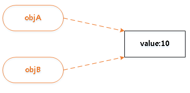

## 3.3 참조 타입의 특성
자바스크립트에서는 기본 타입인 `숫자`, `문자열`, `불린값`, `null`, `undefined` 5가지를 제외한 모든 값은 객체다.  
이러한 객체는 자바스크립트에서 참조타입이라고 부른다.  
이것은 객체의 모든 연산이 **실제 값이 아닌 참조값** 으로 처리되기 때문이다.  

```js
//동일한 객체를 참조하는 두 변수 objA와 objB
var objA = {
    val : 10
}

var objB = objA;

console.log(objA.val);  // (출력값 10)
console.log(objB.val);  // (출력값 10)

objB.val = 50;

console.log(objA.val);  // (출력값 50)
console.log(objB.val);  // (출력값 50)
```
objA 객체를 객체 리터럴 방식으로 생성했다. 여기서 objA 변수는 객체 자체를 저장하고 있는 것이 아니라 **생성된 객체를 카리키는 참조값을 저장** 하고 있다는 것이다.  

변수 objB에 objA 값을 할당한다. 생성된 객체를 가리키는 참조값을 가지고 있으므로 변수 objB에도 이같은 객체의 참조값이 저장된다.  

  

### 3.3.1 객체 비교
동등 연산자`(==)`를 사용하여 두 객체를 비교할 때도 객체의 프로퍼티값이 아닌 참조값을 비교한다.
```js
//기본 타입과 참조 타입의 비교연산
var a = 100;
var b = 100;

var objA = { value : 100 };
var objB = { value : 100 };
var objC = objB;

console.log(a == b);    // (출력값 true)
console.log(objA == objB);  // (출력값 fasle)
console.log(objB == objC);  // (출력값 true)
```
a와 b는 숫자 100을 저장하고 있는 기본 타입의 변수이다.  
기본 타입의 경우 동등 연산자(==)를 이용해서 비교할 때 **값을 비교** 한다.  

objA와 objB는 다른 객체지만, 같은 형태의 프로퍼티값을 가지고 있다.  

하지만 동등 연산자(==)로 두 객체를 비교하면 **false** 가 된다.

기본 타입의 경우 값 자체를 비교해서 일치 여부를 판단하지만,  
객체와 같은 참조 타입의 경우는 **참조값이 같아야 true** 가 된다.


### 3.3.2 참조에 의한 함수 호출 방식

기본 타입과 참조 타입의 경우는 함수 호출 방식도 다르다.  
#### 기본 타입
기본 타입의 경우 **값에 의한 호출(Call By Value)** 방식으로 동작한다.  

즉, 함수를 호출할 때 인자로 기본 타입의 값을 넘길 경우 호출된 함수의 매개변수로 **복사된 값** 이 전달된다.  

때문에 함수 내부에서 매개변수를 이용해 값을 변경해도, 실제로 호출된 변수의 값이 변경되지는 않는다.  

#### 참조 타입
참조 타입의 경우 함수를 호출 할 때 **참조에 의한 호출(Call By Reference)** 방식으로 동작한다.  

즉, 함수를 호출할 때 인자로 참조 타입인 객체를 전달할 경우, 객체의 프로퍼티값이 함수의 매개변수로 복사되지 않고, 인자로 넘긴 **객체의 참조값이 그대로 함수 내부로 전달** 된다.  

때문에 함수 내부에서 참조값을 이용해서 인자로 넘김 실제 객체의 값을 변경할 수 있는 것이다.

## [3.4 프로토타입](./chapter03-04.md)
