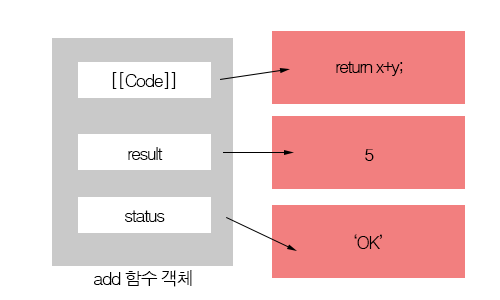
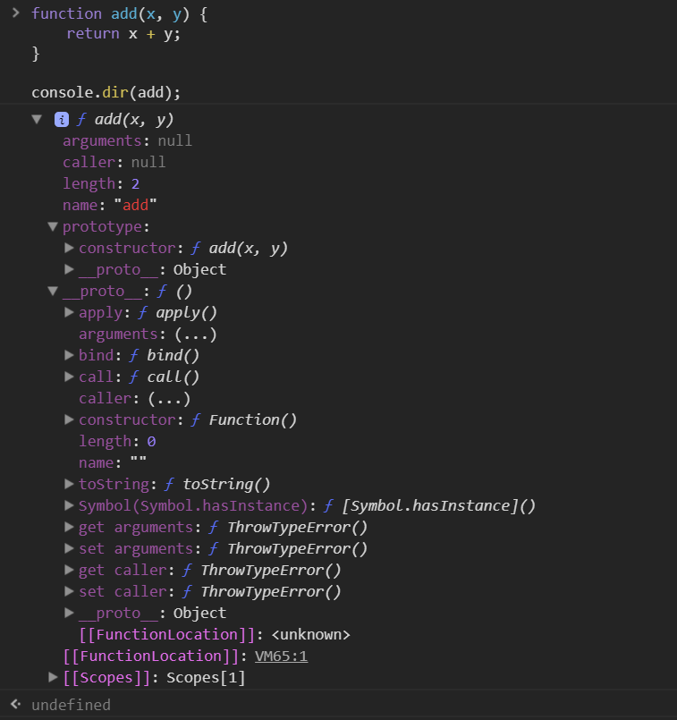
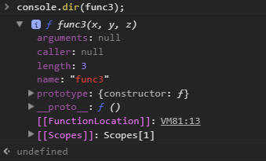
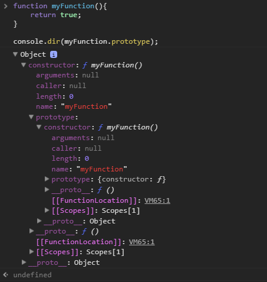

## 4.2 함수 객체 : 함수도 객체다

### 4.2.1  자바스크립트에서는 함수도 객체다.
자바스크립트에서는 **함수도 객체** 다.  
즉, 함수의 기본 기능인 코드 실행뿐만 아니라, 함수 자체가 일반 객체처럼 프로퍼티들을 가질 수 있다.
```js
//함수 선언 방식으로 add() 함수 정의
function add(x, y){
    return x + y;
}

//add() 함수 객체에 result, status 프로퍼티 추가
add.result = add(3, 2);
add.status = 'OK';

console.log(add.result);    // (출력값 5)
console.log(add.status);    // (출력값 OK)
```
위 예제와 같이 자바스크립트에서 함수는 특정 기능의 코드를 수행하는 역할뿐만 아니라,  
일반 객체처럼 자신의 프로퍼티를 가질 수 있는 특별한 객체라고 볼 수 있다.  

  


### 4.2.2 자바스크립트에서 함수는 값으로 취급된다.
자바스크립트에서 함수는 객체다.  
이는 **함수도 일반 객체처럼 취급될 수 있다.** 는 것을 말한다.  
때문에 자바스크립트 함수는 다음과 같은 동작이 가능하다.
- 리터럴에 의해 생성
- 변수나 배열의 요소, 객체의 프로퍼티 등에 할당 가능
- 함수의 인자로 전달 가능
- 함수의 리턴값으로 리턴 가능
- 동적으로 프로퍼티를 생성 및 할당 가능

이와 같은 특징이 있으므로 자바스크립트에서는 함수를 **일급(first Class)객체** 라고 부른다.  

자바스크립트 함수의 기능은 C나 자바와 같은 다른 언어 함수의 기능과 거의 비슷하다.  
**입력한 값을 받아 처리한 다음 그 결과를 반환하는 구조** 다.  

하지만 이러한 기본적인 기능 외에도 자바스크립트에서 함수를 제대로 이해하려면 함수가 일급 객체이며 이는 곧 함수가 **일반 객체처럼 값(value)으로 취급** 된다는 것을 이해해야 한다.  

#### 4.2.2.1 변수나 프로퍼티의 값으로 할당  

함수는 숫자나 문자열처럼 변수나 프로퍼티의 값으로 할당될 수 있다.  

```js
//변수에 함수 할당
var foo = 100;
var bar = function(){ return 100; };
console.log(bar());     // 출력값 100

// 프로퍼티에 함수 할당
var obj = {};
obj.baz = function(){ return 200; };
console.log(obj.baz()); // 출력값 200
```

#### 4.2.2.2 함수 인자로 전달

함수는 다른 함수의 인자로도 전달이 가능하다.  
```js
// 함수 표현식으로 foo() 함수 생성
var foo = function(func){
    func();     // 인자로 받은 func() 함수 호출
};
// foo() 함수 실행
foo(function(){
    console.log('Function can be used as the argument');
});
```
foo() 함수를 호출할 때, 함수 리터널 방식으로 생성한 **익명함수** 를 func 인자로 넘겼다.  
따라서 foo() 함수 내부에서는 func 매개변수로 인자에 넘겨진 함수를 호출할 수 있다.  

#### 4.2.2.2 함수 인자로 전달

함수는 다른 함수의 인자로도 전달이 가능하다.  

```js
// 함수 표현식으로 foo() 함수 생성
var foo = function(func){
    func(); // 인자로 받은 func() 함수 호출
};
foo(function(){
    console.log('Function can be used as the argument');
});
```

#### 4.2.2.3 리턴값으로 활용

함수는 다른 함수의 리턴값으로도 활용할 수 있다.  
이것이 가능한 이유 또한 함수 자체가 값으로 취급되기 때문이다.

```js
// 함수를 리턴하는 foo() 함수 정의
var foo = function(){
    return function(){
        console.log('this function is the return value');
    };
};

var bar = foo();
bar();
```


### 4.2.3 함수 객체의 기본 프로퍼티

지금까지 계속 강조했듯이 자바스크립트에서는 함수 역시 객체다.  
이것은 함수 역시 일반적인 객체의 기능에 추가로 호출됐을 때 정의된 코드를 실행하는 기능을 가지고 있다는 것이다.  
또한, 일반 객체와는 다르게 추가로 **함수 객체만의 표준 프로퍼티** 가 정의되어 있다.

```js
function add(x, y) {
    return x + y;
}

console.dir(add);
```

  

결과를 살펴보면 add() 함수는 arguments, caller, length 등과 같은 다양한 프로퍼티가 기본적으로 생성된 것을 확인할 수 있다.  
이러한 프로퍼티들이 함수를 생성할 때 포함되는 표준 프로퍼티다.  

ECMA5 스크립트 명세서에는 모든 함수가 **length** 와 **prototype 프로퍼티** 를 가져야 한다고 기술하고 있다.  

**caller 프로퍼티**  

자신을 호출한 함수를 나타낸다.  
위 예제에서는 add() 함수를 호출하지 않았으므로, `null` 값이 나왔다.  


**arguments 프로퍼티**  

함수를 호출할 때 전달된 인자값을 나타내는데 현재는 add() 함수가 호출된 상태가 아니므로 `null` 값이 출력됐다.  

**__proto__ 프로퍼티**  

 **3.4 프로토타입** 에서 모든 자바스크립트 객체는 자신의 프로토타입을 가리키는 **[[Prototype]]라는 내부 프로퍼티** 를 가진다고 설명했다.  

 ECMA 표준에서는 add()와 같이 함수 객체의 부모 역할을 하는 프로토타입 객체를 **Function.prototype 객체** 라고 명명하고 있으며, 이것 역시 **함수 객체** 라고 정의 하고 있다.

#### 4.2.3.1 lenth 프로퍼티

함수 객체의 **length 프로퍼티** 는 앞서 설명했듯이 ECMAScript에서 정한 모든 함수가 가져야 하는 표준 프로퍼티로서, 함수가 정상적으로 실행될 때 기대되는 인자의 개수를 나타낸다.

```js
// 함수 객체의 length 프로퍼티
function func0(){

}

function func1(x){
    return x;
}

function func2(x, y){
    return x + y;
}

function func3(x, y, z){
    return x + y + z;
}

console.log('func0.length - ' + func0.length);  // (출력값 func0.length - 0)
console.log('func1.length - ' + func1.length);  // (출력값 func0.length - 1)
console.log('func2.length - ' + func2.length);  // (출력값 func0.length - 2)
console.log('func3.length - ' + func3.length);  // (출력값 func0.length - 3)
```

  

위 예제 코드는 인자 개수가 서로 다른 함수들로 구성되어 있다.  
출력값을 살펴보면 함수 객체의 length 프로퍼티는 함수를 작성할 때 `정의한 인자 개수`를 나타내고 있음을 확인할 수 있다.

#### 4.2.3.2 prototype 프로퍼티

모든 함수는 객체로서 **prototype 프로퍼티** 를 가지고 있다.  
여기서 주의할 것은 함수 객체의 **prototype 프로퍼티** 는 앞서 설명한 모든 객체의 부모를 나타내는 **내부 프로퍼티** 인 **[[Prototype]]** 과 혼동하지 말아야 한다는 것이다.  

>NOTE prototype 프로퍼티와 [[Prototype]] 프로퍼티  
두 프로퍼티 모두 **프로퍼티 객체** 를 가리킨다는 점에서는 공통점이 있지만, 관점에 차이가 있다.  
모든 객체에 있는 내부 프로퍼티인 [[Protytpe]]는 객체 입장에서 자신의 부모 역할을 하는 포로토타입 객체를 가리키는 반면에, 함수 객체가 가지는 **prototype 프로퍼티** 는 이 함수가 생성자로 사용될 때 이 함수를 통해 생성된 객체의 부모 역할을 하는 프로토타입 객체를 가리킨다.  

prototype 프로퍼티는 함수가 생성될 때 만들어지며, 단지 **consturctor 프로퍼티** 하나만 있는 객체를 가리킨다.  
그리고 prototype 프로퍼티가 가리키는 프로토타입 객체의 유일한 consturctor 프로퍼티는 자신과 연결된 함수를 가리킨다.  
즉, 자바스크립트에서는 함수를 생성할 때, 함수 자신과 연결된 프로토타입 객체를 동시에 생성하며, 이 둘은 각각 prototype과 consturctor라는 프로퍼티로 서로를 참조하게 된다.

```js
// MyFunction() 함수 정의
function myFunction(){
    return true;
}

console.dir(myFunction.prototype);
console.dir(myFunction.prototype.consturctor);
```

  

## [4.3 함수의 다양한 형태](./chapter04-03.md)
