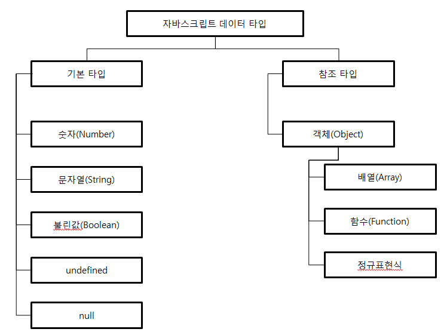

# 03 자바스크립트 테이터 타입과 연산자
모든 언어의 기본은 데이터 타입을 파악하는 것에서부터 시작한다.  
자바스크립트의 값들은 크게 `기본타입`과 `참조타입`으로 나뉜다.

## [3.1 자바스크립트의 기본 타입](./ch03/chapter03-01.md)

## [3.2 자바스크립트 참조 타입(객체 타입)](./ch03/chapter03-02.md)

## [3.3 참조 타입의 특성](./ch03/chapter03-03.md)

## [3.4 프로토타입](./ch03/chapter03-04.md)

## [3.5 배열](./ch03/chapter03-05.md)
